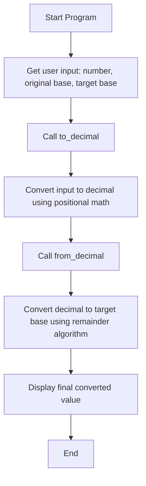

[](https://classroom.github.com/open-in-codespaces?assignment_repo_id=21262093)
# The Hexorcist: Base Conversion Without Forbidden Magic

# The Hexorcist: Base Conversion Without Forbidden Magic

**Author:** Brody Barnes  
**Language:** Python 3  
**Tagline:** "The Power of Math Compels You!"

---

## Overview

The Hexorcist is a Python program that converts numbers between any two bases (2–36) without using any forbidden functions such as:

- bin()
- hex()
- oct()
- format()
- int(..., base)

Instead, it relies purely on loops, arithmetic (+, -, *, /, //, %, **), and logic.

The program uses Base-10 as a translator (like a mathematical "Babel Fish"):

1. Convert the number to Base-10 (decimal)  
2. Convert that decimal to the new target base

---

## How It Works

### 1. to_decimal(number_string, original_base)
Converts a string (e.g., "C7") from its base into a decimal number using positional math.

Example:
```
C7 (Base 16)
= (12 × 16¹) + (7 × 16⁰)
= 192 + 7 = 199
```

### 2. from_decimal(decimal_number, target_base)
Converts a decimal integer into the target base using the remainder algorithm.

Example:
```
199 ÷ 16 = 12 remainder 7 → '7'
12 ÷ 16 = 0 remainder 12 → 'C'
Result = 'C7'
```

---

## Flowchart (Mermaid)



---

## Example Run

```
Welcome to The Hexorcist. THE POWER OF MATH COMPELS YOU!

Enter the number you want to convert: 1A4
Enter the number's CURRENT base (2-36): 16
Enter the NEW base you want (2-36): 10

...calculating with sticks and stones...

'1A4' (Base-16) is '420' (Base-10).

